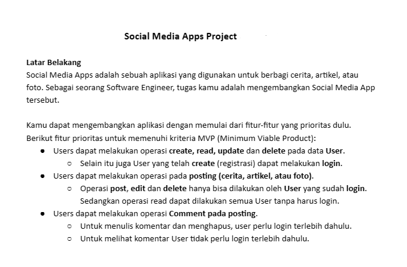

# Social Media Apps Project (Golang)

## Latar Belakang
Social Media Apps adalah aplikasi yang memungkinkan pengguna untuk berbagi cerita, artikel, atau foto. Sebagai seorang Software Engineer, tugas Anda adalah mengembangkan Social Media App ini.

## Teknologi
Proyek ini menggunakan Golang, sebuah bahasa pemrograman yang kuat dan efisien. Golang dipilih karena performanya yang cepat, dukungan konkurensi, dan ekosistem library yang kuat.

## Pembuat

- **LENDRA SYAPUTRA** - BE 19 ALTA
- **GALIH PRAYOGA** - BE 19 ALTA


## Cara Menjalankan
1. Pastikan Golang sudah terinstal di sistem Anda.
2. Salin repository ini ke direktori lokal Anda.
3. Buka terminal dan arahkan ke direktori proyek.
4. Jalankan aplikasi dengan perintah berikut:
   ```bash
   go run main.go
